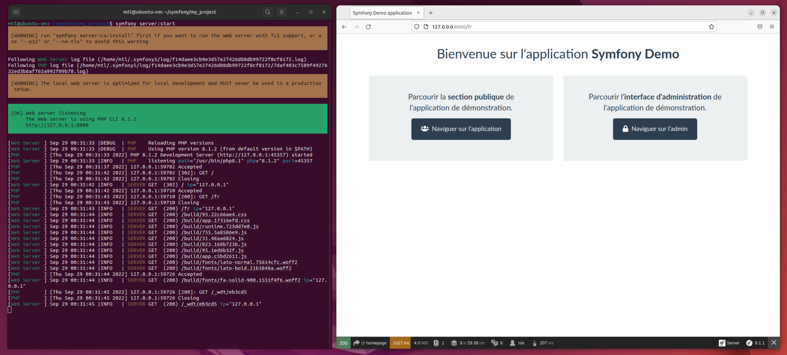
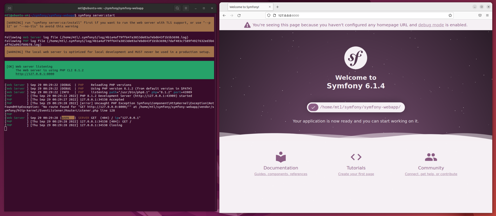
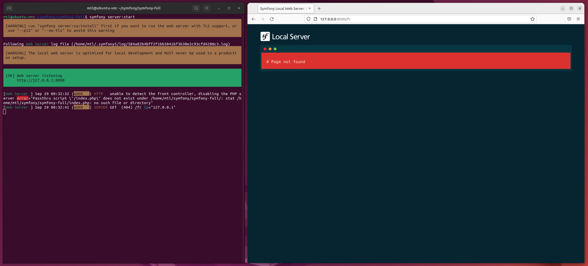
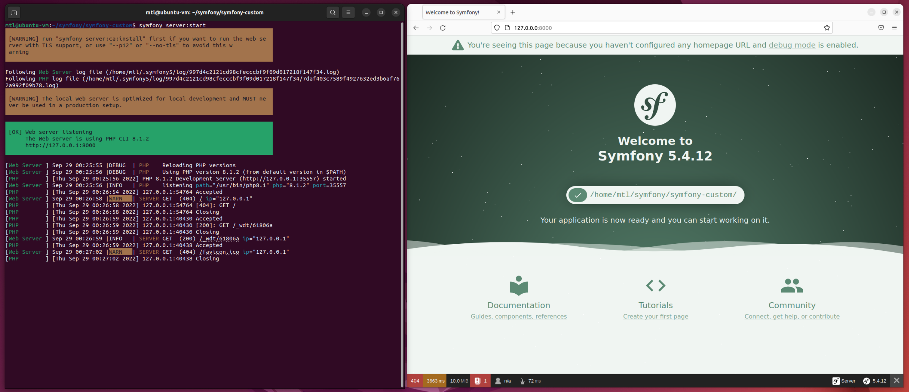

# Guide Ubuntu 20.04 & Symfony 5

Ceci est un guide pour installer les dépendances nécessaire au bon fonctionnnement d'un projet Symfony sur Ubuntu 20.04

## 1 - Demo Application using Symfony 5, Bootstrap 4 and Webauthn

- [symfony-demo](https://github.com/web-auth/symfony-demo.git)

### 1.1 - Mise à jour et Installation de tout 😎

Mise à jour de Ubuntu et installation de essentiels.

```
sudo apt update && apt upgrade
sudo apt install git tree nano zip unzip
```

Installation de Composer PHP, Xdebug, OPcache

```
sudo apt install php php-json php-ctype php-curl php-mbstring php-xml php-zip php-tokenizer php-tokenizer libpcre3 --no-install-recommends

sudo apt install php8.1-amqp
sudo apt install php8.1-apcu
sudo apt install php8.1-dom
sudo apt install php8.1-gd
sudo apt install php8.1-gmp
sudo apt install php8.1-pdo
sudo apt install php8.1-pgsql
sudo apt install php8.1-redis
sudo apt install php8.1-simplexml
sudo apt install php8.1-sqlite3
sudo apt install php8.1-xdebug
sudo apt install php8.1-xml

sudo apt install composer
```

### 1.2 - Résultat

```
PHP 8.1.2 (cli) (built: Aug  8 2022 07:28:23) (NTS)
Copyright (c) The PHP Group
Zend Engine v4.1.2, Copyright (c) Zend Technologies
    with Zend OPcache v8.1.2, Copyright (c), by Zend Technologies
    with Xdebug v3.1.2, Copyright (c) 2002-2021, by Derick Rethans
```

## 2 - Installation de Symfony CLI

[Source du guide si besoin - Php-symfony](https://installati.one/ubuntu/22.04/php-symfony/)

Il est possible d'installer les dépendeances `php-symfony` et `php-symfony-console`.

```
sudo apt -y install php-symfony
sudo apt -y install php-symfony-console
```

On importe et installe le package de Symfony-CLI

```
sudo wget https://get.symfony.com/cli/installer -O - | bash
```

Résutlat

```
The Symfony CLI was installed successfully!

Use it as a local file:

  /home/ldumay/.symfony5/bin/symfony
Or add the following line to your shell configuration file:

  export PATH="$HOME/.symfony5/bin:$PATH"

Or install it globally on your system:

  mv /home/ldumay/.symfony5/bin/symfony /usr/local/bin/symfony

Then start a new shell and run 'symfony'
```

Choisisser cette commande pour attacher Symfony CLI au terminal :

```
mv /home/ldumay/.symfony5/bin/symfony /usr/local/bin/symfony
```

Voilà, vous pouver maintenant exécuter la commande `symfony`.

Résultat : 

```
> symfony

Symfony CLI version 5.4.13 (c) 2017-2022 Symfony SAS #StandWithUkraine Support Ukraine (2022-08-16T08:17:04Z - stable)
Symfony CLI helps developers manage projects, from local code to remote infrastructure
These are common commands used in various situations:
Work on a project locally
  new                                                            Create a new Symfony project
  server:start                                                   Run a local web server
  server:stop                                                    Stop the local web server
  security:check                                                 Check security issues in project dependencies
  composer                                                       Runs Composer without memory limit
  console                                                        Runs the Symfony Console (bin/console) for current project
  php, pecl, pear, php-fpm, php-cgi, php-config, phpdbg, phpize  Runs the named binary using the configured PHP version

Manage a project on Cloud

  init                Initialize a new project using templates
  cloud:domains       Get a list of all domains
  cloud:branch        Branch an environment
  cloud:environments  Get a list of environments
  cloud:push          Push code to an environment
  cloud:ssh           SSH to the current environment
  cloud:projects      Get a list of all active projects
  cloud:tunnel:open   Open SSH tunnels to an app's relationships
  cloud:user:add      Add a user to the project
  cloud:variables     List variables

Show all commands with symfony help,

Get help for a specific command with symfony help COMMAND.
```

## 3 - Importation d'un projet de démo Symfony

### 3.1 - Symfony - Github.com

[Symfony](https://github.com/symfony)

### 3.2 - Symfony  - Possibilités de création

[Symfony Demo Application](https://github.com/symfony/demo)

```
symfony new --demo symfony-demo

symfony new --webapp symfony-webapp

symfony new --full symfony-full

symfony new --full --no-git --debug --version=lts symfony-custom
```

---



Symfony new **demo**



Symfony new **webapp**



Symfony new **full**



Symfony new **custom** <=> **full + no-git + debug + lts**

---


### 3.3 - Symfony  - Possibilités de création - modèle Book

```
$ symfony new --book --version=lts symfony-book

Checking Book Requirements
--------------------------
[OK] Git installed
[OK] PHP installed version 8.1.2 (/usr/bin/php8.1)
[OK] PHP extension "zip" installed - optional - needed only for chapter 17 (Panther)
[OK] PHP extension "ctype" installed - required
[OK] PHP extension "xml" installed - required
[OK] PHP extension "intl" installed - required
[OK] PHP extension "mbstring" installed - required
[OK] PHP extension "xsl" installed - required
[OK] PHP extension "sodium" installed - required
[OK] PHP extension "curl" installed - optional - needed only for chapter 17 (Panther)
[OK] PHP extension "amqp" installed - optional - needed only for chapter 32
[OK] PHP extension "json" installed - required
[OK] PHP extension "session" installed - required
[OK] PHP extension "openssl" installed - required
[OK] PHP extension "gd" installed - optional - needed only for chapter 23 (Imagine)
[OK] PHP extension "redis" installed - optional - needed only for chapter 31
[OK] PHP extension "tokenizer" installed - required
[OK] PHP extension "pdo_pgsql" installed - required
[OK] Composer installed
[KO] Cannot find Docker, please install it https://www.docker.com/get-started
[KO] Cannot find Docker Compose, please install it https://docs.docker.com/compose/install/
[OK] Yarn installed                                                              
  You should fix the reported issues before starting reading the book.  
```

> Sur mon tese il manque Docker :
>   - Docker

### 3.4 - Projet de démonstration Symfony avec Auth

Voici un petit projet de démonstrtation à importer pour testé notre installation

```
git clone https://github.com/web-auth/symfony-demo.git
```

Déplacez-vous dans le dossier du projet et installer les dépendances Composer nécessaires.

```
cd symfony-demo/
composer install
```

Démarrer le projet.

```
symfony server:start
```

Accéder au projet [http://localost:8000](http://localost:8000)

## Autres

Pour supprimer :

```
sudo apt -y autoremove --purge php-symfony
```